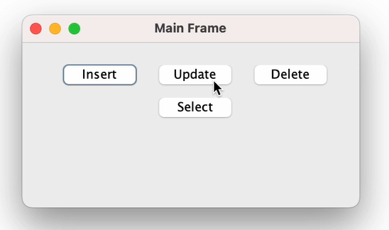
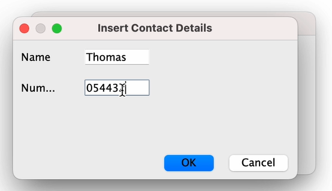
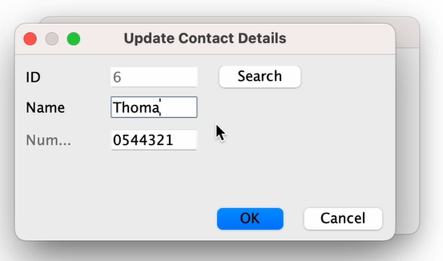
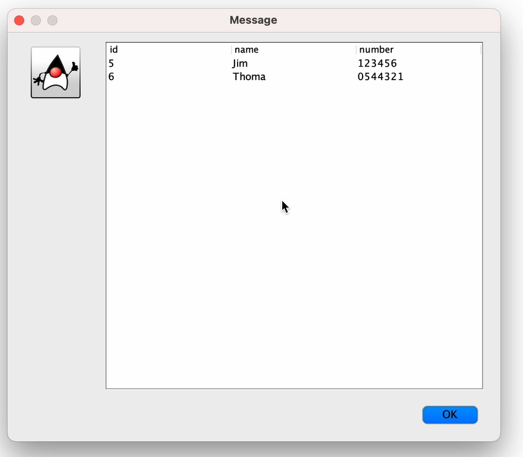
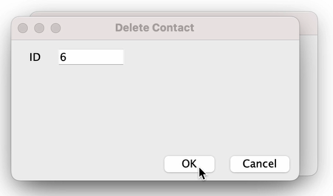

## Exercice 3 Application desktop

**Objectif :** Utiliser swing en lien avec votre SGBD pour crée une persistance au sein de votre application.

- technos : swing/hibernate

- Le but de l'exercice est de réaliser une application qui permet via un formulaire va permettre d'ajouter une personne avec un prénom et un numéros de téléphone.
- notre application nous permet aussi de venir modifier et de la supprimer par l'id
- apres chaque ajout/moddification/ suppresion dans la BDD on auras un message de validation 
- Eton auras un affichage de toute les personne presente dans la base de donnée 

