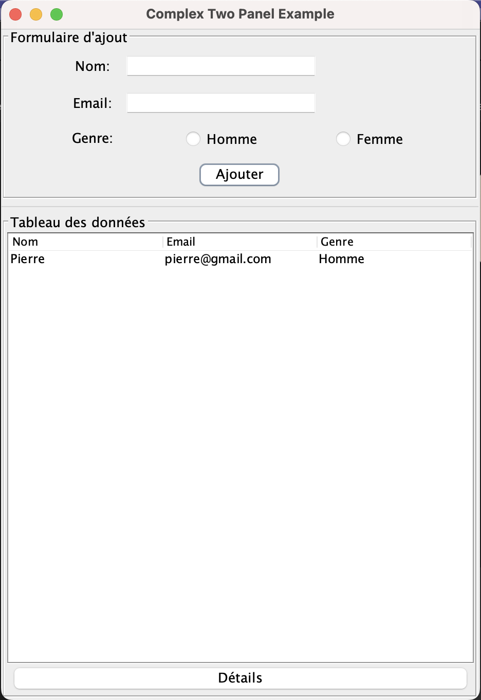
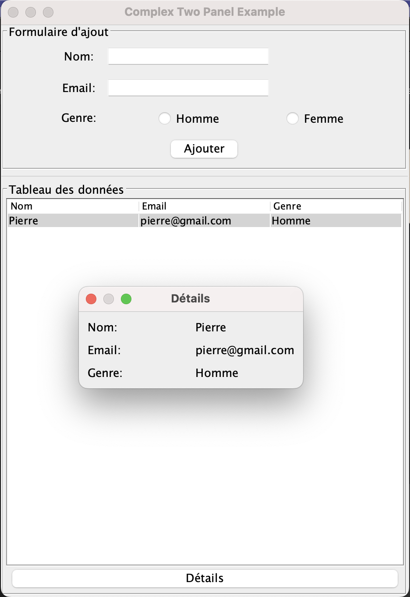

## Exercice 2 Application desktop

**Objectif :** Comprendre le fonctionnement des grids en desktop.

Le but de l'exercice est de réaliser une application qui permet via un formulaire d'ajouter des personnes possédant un nom/email/genre a notre tableau (JTable et DefaultTableModel) et de permettre d'afficher dans une pop up les detail des informations lorsque l'on clique sur le bouton detail (JDialog).

